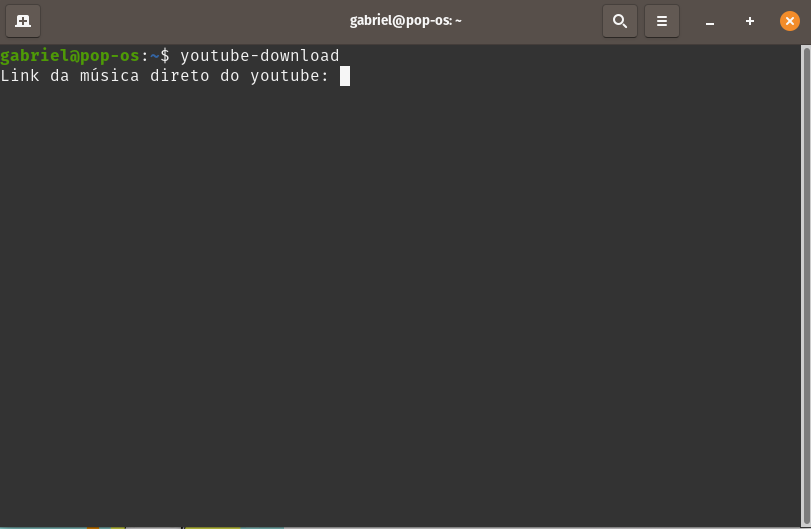

# YouTube Music Downloader

Um script para automatizar o download de musicas (em formato mp3) usando links do youtube através da linha de comando.

## Como foi desenvolvido

Biblioteca pupperteer utilizada para fazer a navegação dentro do conversor de mp3 e realizar o download.

Biblioteca readline utilizada para receber o link da música para fazer download.

## Rodando em sua máquina

Tendo o Node instalado em sua máquina, basta clonar o repositório e instalar as dependências com: 

```
git clone https://github.com/CavalheiroDev/youtube-download-music.git
npm install
```

Após isso, basta rodar o programa utilizando:
```
npm start
```

Caso queira pode criar uma atalho de terminal para rodar o script como na imagem abaixo:


